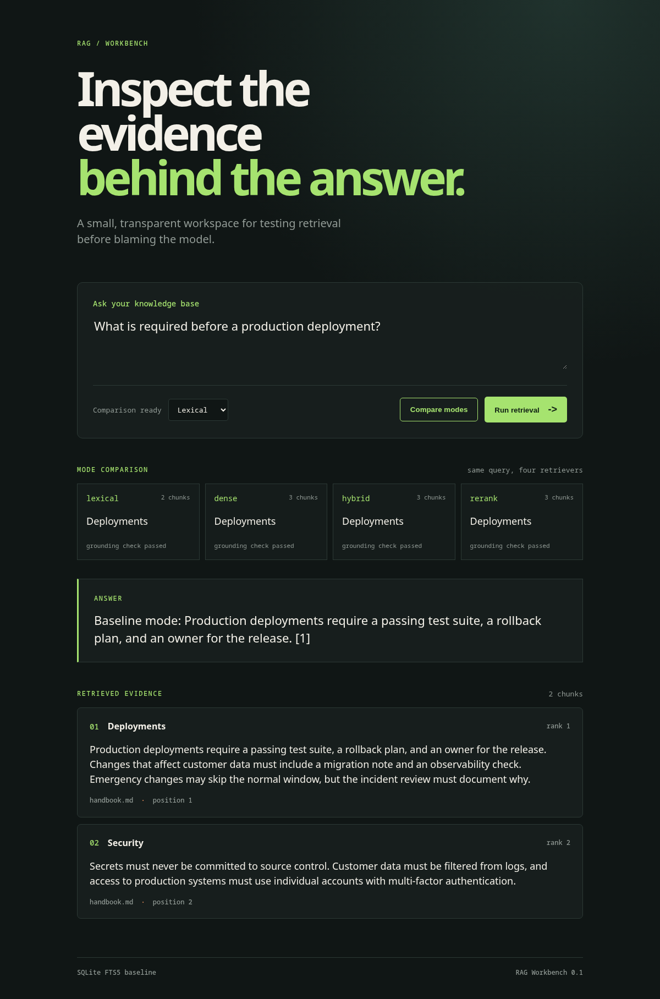

# RAG Workbench

[](https://github.com/Miguel-EpicJS/rag-workbench/actions/workflows/ci.yml)

An inspectable workbench for improving retrieval-augmented generation systems.

This is not another chatbot wrapper. The project makes the retrieval layer visible so each
iteration can be measured:

```text
documents -> section-aware chunks -> SQLite FTS5 -> ranked evidence -> grounded answer
```

The workbench keeps a deterministic baseline alongside advanced techniques so each change can be
compared instead of assumed to be better.

## Visual preview

The UI keeps the generated answer and its retrieved evidence together, making it easier to see
when a response is grounded in the right document and section.



## Why this project exists

Many RAG failures are blamed on the LLM before anyone inspects the evidence sent to it. RAG
Workbench exposes the document, section, chunk position, text, and retrieval score returned for
each question. That makes it possible to turn vague quality discussions into reproducible
experiments.

## Features

- Markdown-aware section splitting
- Overlapping chunks with document and section metadata
- Local SQLite persistence with FTS5 retrieval
- Evidence-first query responses
- Optional OpenAI-compatible generation for Ollama, llama.cpp, or hosted APIs
- CLI and FastAPI interfaces
- Browser UI for inspecting retrieved evidence
- Retrieval mode comparison across lexical, dense, hybrid, and reranked results
- Citation validation and lightweight grounding checks
- Terraform deployment for AWS App Runner
- Tests for chunking, replacement, metadata, and retrieval

## Quick start

```bash
uv sync --extra dev
uv run rag-workbench --db demo.db ingest data/handbook.md
uv run rag-workbench --db demo.db query "What is required before a production deployment?"
```

Without an LLM configured, the query command still returns the retrieved evidence. To enable
generation, point the project at an OpenAI-compatible endpoint:

```bash
export LLM_BASE_URL=http://localhost:8080/v1
export LLM_MODEL=qwen-local
uv run rag-workbench --db demo.db query "What is required before a production deployment?"
```

Start the API with:

```bash
uv run uvicorn rag_workbench.api:app --reload
```

Set `RAG_DB_PATH` when the API should use a specific persistent database:

```bash
RAG_DB_PATH=demo.db uv run uvicorn rag_workbench.api:app --reload
```

Then ingest and query documents with JSON:

```bash
curl -X POST http://localhost:8000/documents \
  -H 'content-type: application/json' \
  -d '{"id":"handbook","title":"Engineering Handbook","text":"# Deployments\nProduction deployments require a rollback plan."}'

curl -X POST http://localhost:8000/query \
  -H 'content-type: application/json' \
  -d '{"question":"What is required for deployments?","limit":3}'
```

## Experiment roadmap

- [x] Section-aware chunking baseline
- [x] Inspectable lexical retrieval
- [x] Evidence-first API and CLI
- [x] Retrieval evaluation dataset and metrics
- [x] Continuous integration with linting and tests
- [x] Dense embeddings and hybrid rank fusion
- [x] Cross-encoder reranking (optional local model)
- [x] Contextual chunk enrichment
- [x] Citation validation and answer faithfulness checks
- [x] Web UI for comparing retrieval experiments

## Development

```bash
uv sync --extra dev
uv run pytest
```

See [docs/experiments.md](docs/experiments.md) for the baseline result and the experiment
template used for future retrieval changes.

The browser UI runs with `uv run uvicorn rag_workbench.api:app --reload`. See
[terraform/README.md](terraform/README.md) for the AWS App Runner deployment path.

## Content series

This repository is designed to evolve in public. Each roadmap step can become a technical
write-up comparing one change against the baseline: what changed, which failures improved, and
what it cost in latency or complexity.

## License

MIT
